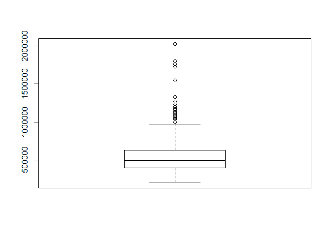
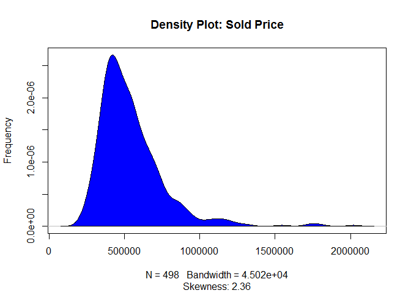
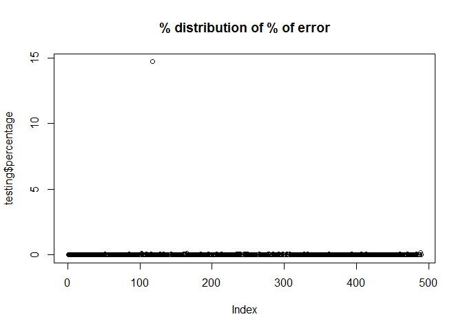

Trying to solve the House Pricing problem: Calgary
--------------------------------------------------

Problem
-------

At a high level, we are building a residential real estate marketplace
in which we will be buying and selling homes and set the price. Our
model needs to tell us which homes to buy, and provide us with comfort
that for the homes we do buy, we know what price we can resell them for
and how long it will take to do so.

In this folder you can see the sample data from Calgary (just historical
sales data from the MLS). **The goal is to take an initial (v0) model
that helps us decide what the value of a house should be.**

We also need to write a simple report (can be bullet points) detailing
your technical decisions, how those decisions would impact the business,
and the type of additional work I would do to improve upon the model
with more time.

Steps to model
--------------

Before we start, I need to point it out two personal preferences: I
usually like doing modeling with data frame structures. And I am using R
and python in this project: Python to clean the data and R to model it.

1.  Read the json type of file and translate into data frames we will be
    using the cleaning\_file.py file in the /code directory to perform
    this step

2.Import the desired files into R. It is best practice to split the data
into training and testing. For the purposes of this project I decided to
use one file to test and one to train, but you can use as many as you
want, but they should not overlap. In other words, whatever was used to
train should not be used to test. This will avoid bias towards the
model. For this project i decided to use file 31 from the
Scraper/new\_data folder.

2.1. In this step I noticed that the region did not matter in the model,
unless the house was located at the Altadore community. So instead of
using all variations, I decided to create a dummy variable with yes or
no for this community.

1.  Perform a statistics methodology that can predict price. Here there
    are a few methodologies that can be used. I chose **Multilinear
    Regression because** in my opinion it is a simple method and it
    seems to be predicting well the price of the houses.

2.  With the model diagnostic metrics, decide which features to keep in
    the model. Here I performed a backwards feature selections which
    consists in including all the metrics and then removing one at time
    based on model diagnostics. One important point is that we need to
    understand data correlation. Linear regression is a calculation that
    uses the determinant of the independent variables, if we have a
    variable that is a linear combination of others (i.e. correlated to
    others), the determinant will be 0 and the model is not going
    to convert.

3.  Now that all the tests are passing, it's time to take a step forward
    and test if the model works for other data. This helps us to avoid
    over fitting. I used the file \#2 from the Scraper/new\_data folder
    to test.

4.  Last but not least let's see how far away we got the price from what
    was sold for.

In the future
=============

Ideally we want to add more data in one data frame because the outliers
might become actual data with its own attributes. We would also want to
predict given a price, and the houses feature, how long it will take to
sell with some percentages below the listing price. For example, if the
seller is willing to go as low as 90% of the listing, it will take 30
days to sell, but if the seller agrees to go to 70% of the listing then
it might sell in 5 days.

We would also want to understand how the houses are distributed by zip
code per attribute, for example, houses in one single neighborhood might
be more modern and therefore has a specific price point.

last but not least, economic indicator such as employment rate, growing
economy are things that are related to the real estate market.

Data overview
-------------

The data we are working on looks like the sample below:

    ##   Sold.Price Baths.Full List.Price Total.Parking dom altadore
    ## 1     530000          3     549900             4  34    Other
    ## 2     333000          2     337900             4  27    Other
    ## 3     512000          3     525000             4  18    Other
    ## 4     707500          3     729900             2  67 Altadore
    ## 5     502000          2     524988             2   8    Other
    ## 6     624923          2     655000             6  64    Other

And before we start, it is important to understand outliers and how the
sold.Price values are distributed. A box plot helps to see that:

We can see that there are a few houses skewed towards the $2M value. In
the distribution this is even more evident:

Now we have an idea that we are working with outliers, ideally we want
to treat the outliers because they will affect the model. For now, I
will leave them there for study purposes.

Modeling
========

Now that we know the data distribution, we should start modeling. I have
done some work removing the correlated variables and also the ones with
low p-value and this is what we got:

    ## 
    ## Call:
    ## glm(formula = regression_function, data = training)
    ## 
    ## Deviance Residuals: 
    ##    Min      1Q  Median      3Q     Max  
    ## -94751   -7419    -801    6304   97436  
    ## 
    ## Coefficients:
    ##                 Estimate Std. Error t value Pr(>|t|)    
    ## (Intercept)    1.825e+04  6.592e+03   2.768  0.00585 ** 
    ## Baths.Full     2.596e+03  1.095e+03   2.371  0.01811 *  
    ## List.Price     9.656e-01  3.311e-03 291.656  < 2e-16 ***
    ## Total.Parking  1.328e+03  5.597e+02   2.373  0.01802 *  
    ## dom           -2.298e+02  2.431e+01  -9.452  < 2e-16 ***
    ## altadoreOther -1.336e+04  5.875e+03  -2.274  0.02337 *  
    ## ---
    ## Signif. codes:  0 '***' 0.001 '**' 0.01 '*' 0.05 '.' 0.1 ' ' 1
    ## 
    ## (Dispersion parameter for gaussian family taken to be 227679587)
    ## 
    ##     Null deviance: 2.4913e+13  on 497  degrees of freedom
    ## Residual deviance: 1.1202e+11  on 492  degrees of freedom
    ## AIC: 11004
    ## 
    ## Number of Fisher Scoring iterations: 2

we can see that all the coefficients pass the relevance test
(p-value&lt;0.05) and this is the set of variables with higher R2 (that
measures the quality of the model)

This way our model is something like:

    print(linearMod) 

    ## 
    ## Call:  glm(formula = regression_function, data = training)
    ## 
    ## Coefficients:
    ##   (Intercept)     Baths.Full     List.Price  Total.Parking            dom  
    ##     1.825e+04      2.596e+03      9.656e-01      1.328e+03     -2.298e+02  
    ## altadoreOther  
    ##    -1.336e+04  
    ## 
    ## Degrees of Freedom: 497 Total (i.e. Null);  492 Residual
    ## Null Deviance:       2.491e+13 
    ## Residual Deviance: 1.12e+11  AIC: 11000

Testing
-------

Finally, now let's go out to the "real data" and see how good we
predict. The testing set is the file \#2 therefore was not used in to
model the regression and it's completely unknown data for the model. And
has the sold price, which allows us to see how wrong/right we are.

With the exception of one house, the model is predicting the price
correctly (with less than 5% of error) for the whole testing set. Let's
see what is happening with that one house:

    ##     Sold.Price Baths.Full List.Price Total.Parking dom altadore
    ## 118     390000          1     392900          4321  20    Other
    ##     sold_price_new percentage
    ## 118        6121488   14.69612

Basically when the Realtor typed the number of parking spots there was a
mistake (it is almost impossible one house to have 4321 parking spots)
and therefore the model is having a hard time to predict the price.

We can also take a look at the distributions of correctness of my model
using the table below:

    ## 
    ##    0 0.01 0.02 0.03 0.04 0.05 0.06 0.07 0.08 0.09 0.12 0.17 14.7 
    ##  128  148   93   55   27   18    6    4    2    4    2    1    1

Out of 489 records I have gotten 128 correct. 148 with 1% of error and
etc. Pretty good.
